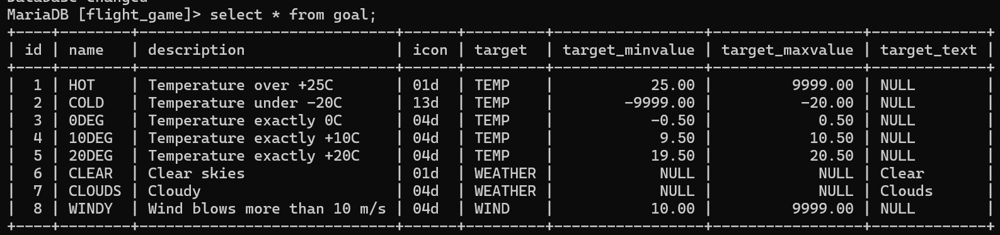
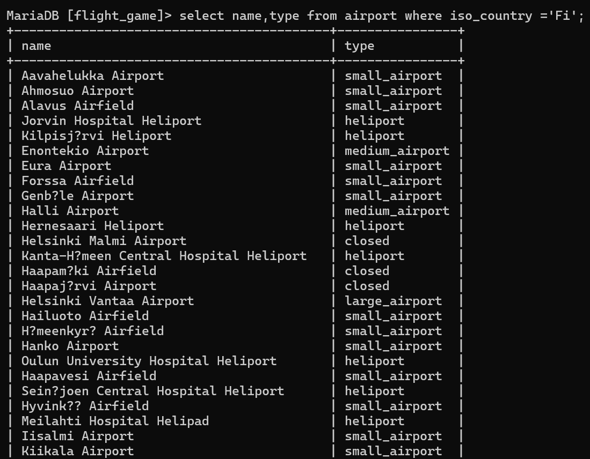
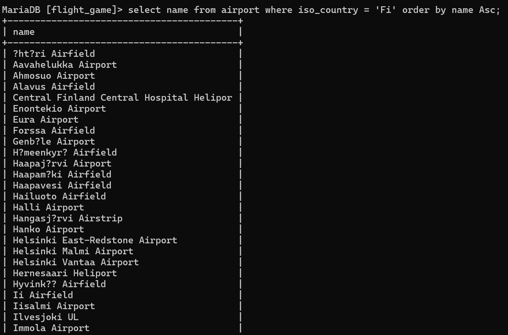
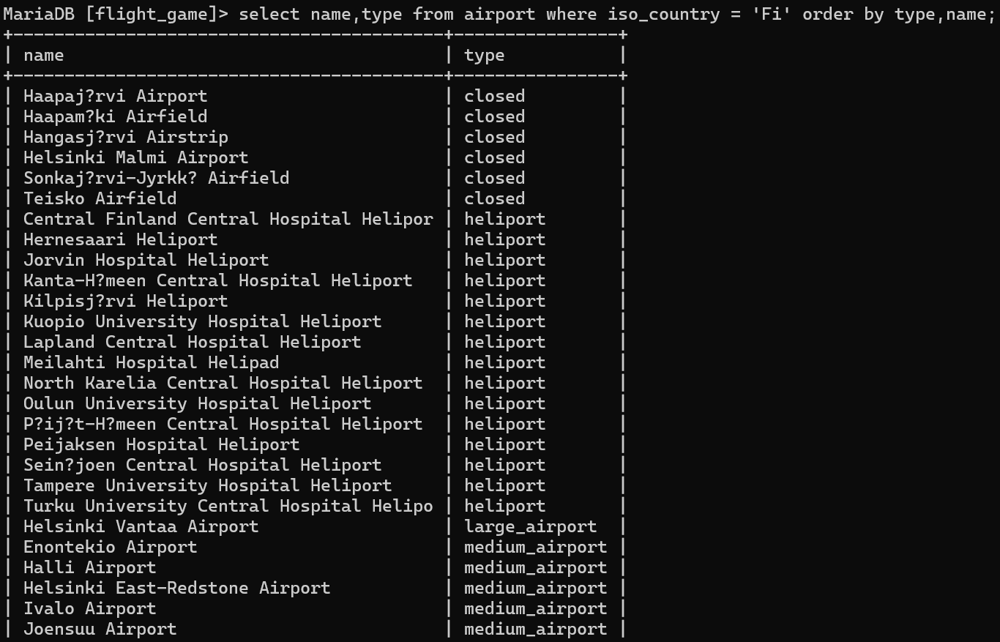
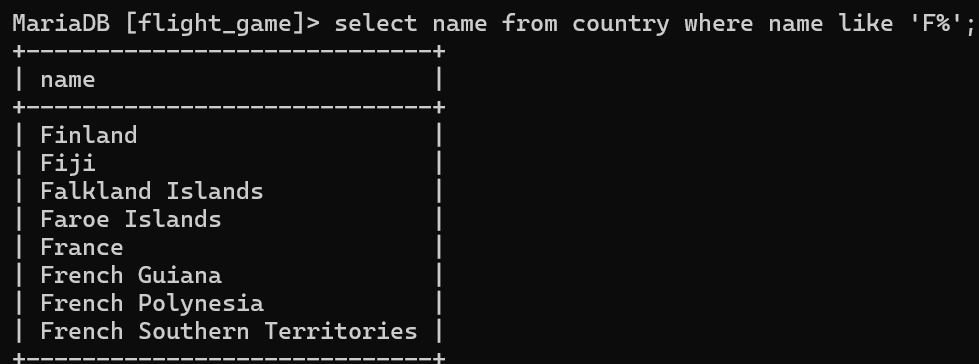
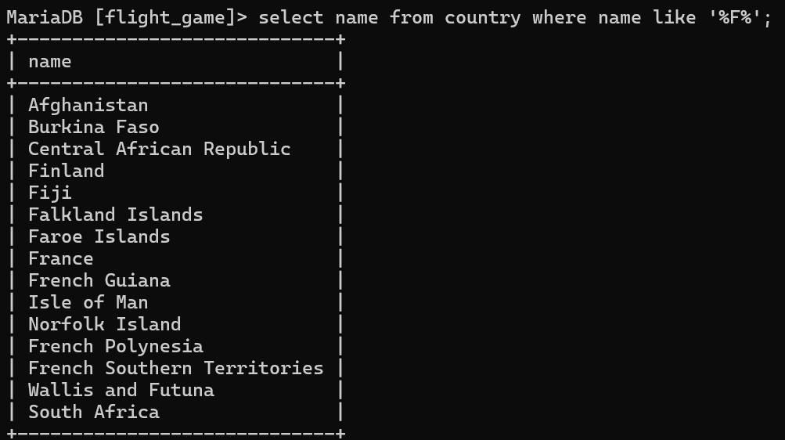
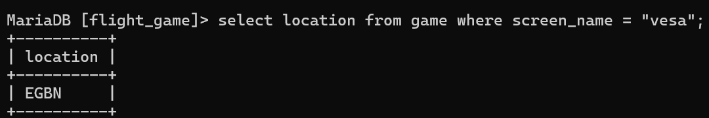
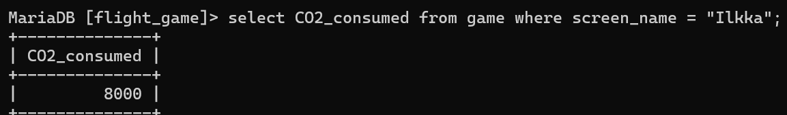
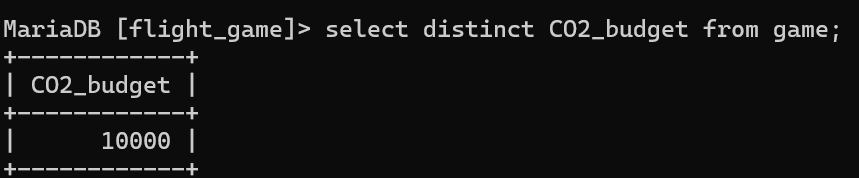

# Week 3
## Exercise 2 - Single table queries
### Question 1
select * from goal;

### Question 2
select name,type from airport where iso_country ='Fi';

### Question 3
select name from airport where iso_country = 'Fi' order by name Asc;

### Question 4
select name,type from airport where iso_country = 'Fi' order by type,name;

### Question 5
select name from country where name like 'F%';

### Question 6
select name from country where name like '%F%';

### Question 7
select location from game where screen_name = "vesa";

### Question 8
select CO2_consumed from game where screen_name = "Ilkka";

### Question 9
select distinct CO2_budget from game;

### Question 10
SET @ CO2_left :=(SELECT SUM (CO2_budget-CO2_consumed)FROM game where screen_name ='Ilkka');
Select screen_name, CO2_budget,CO2_consumed,@CO2_left from game where screen_name = 'Ilkka';

